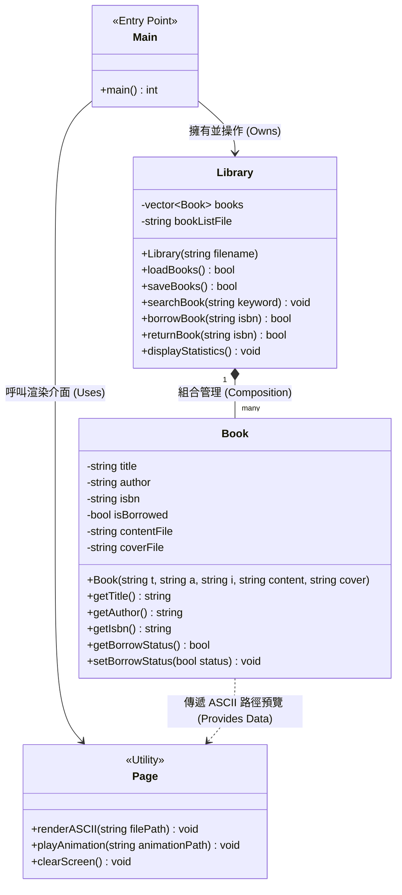

# 圖書管理系統 (Library Management System)

###  專案簡介 (Introduction)
本專案為 **物件導向程式設計 (Object-Oriented Programming)** 的期末專題。

這是一個基於物件導向架構（OOP）設計的圖書管理系統。核心概念將每一本「書本」視為獨立的物件進行操作，旨在模擬真實圖書館中館員與讀者的日常互動。系統不僅提供高效率的藏書查找、借閱、歸還與館藏數據統計功能，更結合了趣味的**電子書預覽功能**，能以 **ASCII Art (字元畫)** 的形式在終端機中呈現電子書的封面與其文本內容。

This is an Object-Oriented Library Management System designed for the 2026 Spring OOP final project. By treating each book as an individual object, the system effectively simulates real-world library operations for both librarians and users—including book searching, borrowing, returning, and collection statistics. Additionally, it features an e-book preview system that renders book covers and contents using creative ASCII Art.

---

### 🛠️ 核心功能 (Core Features)

* **物件化圖書管理 (Object-Oriented Book Operations)**
    * 將書本封裝為物件，管理書名、作者、ISBN、借閱狀態等屬性。
* **館藏統計與查詢 (Search & Statistics)**
    * 提供關鍵字快速查找，並具備圖書館藏書量與借閱率的統計功能。
* **電子書 ASCII Art 預覽 (ASCII Art Preview)**
    * 在終端機介面中，以文字陣列與字元畫（ASCII Art）生動預覽電子書的封面與精選內容。

---

### 📂 檔案結構 (File Structure)

* `main.cpp` - 程式執行入口與主選單控制
* `library.cpp` / `library.h` - 圖書館核心管理邏輯與統計功能
* `book.cpp` / `book.h` - 書本物件類別定義與屬性操作
* `page.cpp` / `page.h` - 處理 ASCII 畫面渲染與電子書預覽
* `TXT/` - 存放書籍內容、封面 ASCII Art 以及動畫文字檔的資料夾

---

### 📐 類別架構圖 (Class Architecture)

以下為本系統的核心類別架構與關聯性：

---

### 🛠️ 開發工具與環境 (Tech Stack)

* **程式語言 (Language):** C++
* **開發概念 (Concepts):** 物件導向程式設計 (Encapsulation, Polymorphism, Abstraction)

---

### ✍️  作者 (Contributors)

* **張友銘** (NYCU EE) - [GitHub Profile](https://github.com/dannlyee14-del)
* **陳暘暄** (NYCU EE) - [GitHub Profile](https://github.com/???????)
